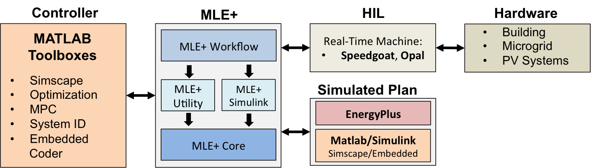

# MLE+
MLE+ is an open-source Matlab/Simulink toolbox for co-simulation with the whole-building energy simulator EnergyPlus. It is designed for engineers and researchers who are familiar with Matlab and Simulink and want to use these software tools in building energy simulation.

MLE+ capabilities include the following:

1. Co-simulation with EnergyPlus.
2. Co-simulation with Simulink models (Simscape).
3. Allow advanced controls in Matlab to operate EnergyPlus buildings.
4. Allow multiple simulation environments to cooperate.
5. Compatible with the [Campus Energy Modeling framework](https://github.com/NREL/CampusEnergyModeling).
6. Allows to seamless integration with Real-Time machine for Hardaware-in-the-loop simulations.

**NOTE:** Other two versons of MLE+ are available:

1. [Legacy Version](http://txn.name/mleplus/mlep_manual.html): This is the original distribution developed by Nghiem Truong.
2. [Graphical user interface](http://www.seas.upenn.edu/~mbehl/mleplus.html): This is graphical user interface for MLE+. This requires the graphics package from Matlab to run. 

# Current Version
MLE+ examples have been updated to work with E+ 8.6.0.

# User Guide
1. [Download & Installation.](https://github.com/willybernal/mlep/wiki/Installation)
2. [Tutorial.](https://github.com/willybernal/mlep/wiki/Tutorial) (COMING!)
3. [Troubleshooting.](https://github.com/willybernal/mlep/wiki/Troubleshooting)

<!--
# Examples
1. Legacy example:
2. MPC example:
3. Augmented simulation capabilities:
4. Integrated Campus Modeling examples:

# MLE+ Tutorial
1. You can find more information about setting up the EnergyPlus file.
2. Building Control Test Bed (BCVTB) 
3. Please find the mlep tutorial for this repo [here](./doc/tutorial/tutorial.pdf)

# MLE+ Projects
1. SPL HIL.
2. Integrated Campus Modeling framework.
3. Microgrid testing.
-->

# Awards
* [Best Demo Award at BuildSys 2012](http://www.buildsys.org/2012/),
4th ACM Workshop On Embedded Systems For Energy-Efficiency In Buildings,
Toronto, Canada.

# Publications
* Willy Bernal, Madhur Behl, Truong Nghiem, and Rahul Mangharam, ["MLE+: A Tool for Integrated Design and Deployment of Energy Efficient Building Controls"](http://repository.upenn.edu/mlab_papers/51/), . October 2012.
* Willy Bernal, Madhur Behl, Truong X. Nghiem, and Rahul Mangharam, ["Campus-Wide Integrated Building Energy Simulation"](http://repository.upenn.edu/cgi/viewcontent.cgi?article=1104&context=mlab_papers), IBPSA Building Simulation Conference, International Building Performance Simulation . December 2015.

