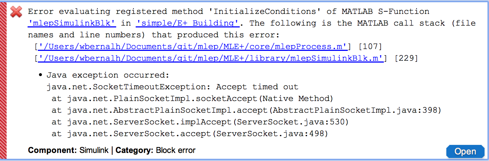
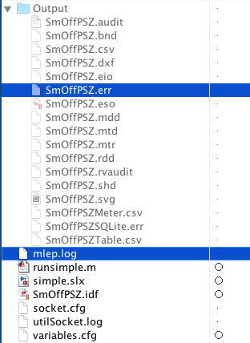

# MLE+
MLE+ is an open-source Matlab/Simulink toolbox for co-simulation with the whole-building energy simulator EnergyPlus. It is designed for engineers and researchers who are familiar with Matlab and Simulink and want to use these software tools in building energy simulation.

**NOTE:** MLE+ has been tested on Matlab 2015a running on Mac and Windows. 

# Installation
1. Download MLE+
You can download the latest version from [here!](https://github.com/willybernal/mlep/archive/master.zip)) or clone this repository.

2. Extract files
Extract all files to a directory in your computer, for example **C:\software\mlep**.

3. Matlab
Open Matlab and change the current directory to the **C:\software\mlep\MLE+** folder that has just been created.

4. Run installMlep.m
In Matlab, run the installation script installMlep.m located in **C:\software\mlep\MLE+\installMlep.m** and follow the instructions included in the file. This will add the necessary paths to the Matlab environment automatically.

  * NOTE: Read further installation instructions on **installMlep.m**

5. Test installation
Go to **Examples/LegacyExample** and open **simple.slx**. Change the settings according to your E+ installation. 

# Simulink Block Configuration
Windows Configuration:

Mac Configuration:

# Error

* The image MLE+ settings are correctly set in Simulink.
* Check mlep.log & eplus_name_file.err. 

