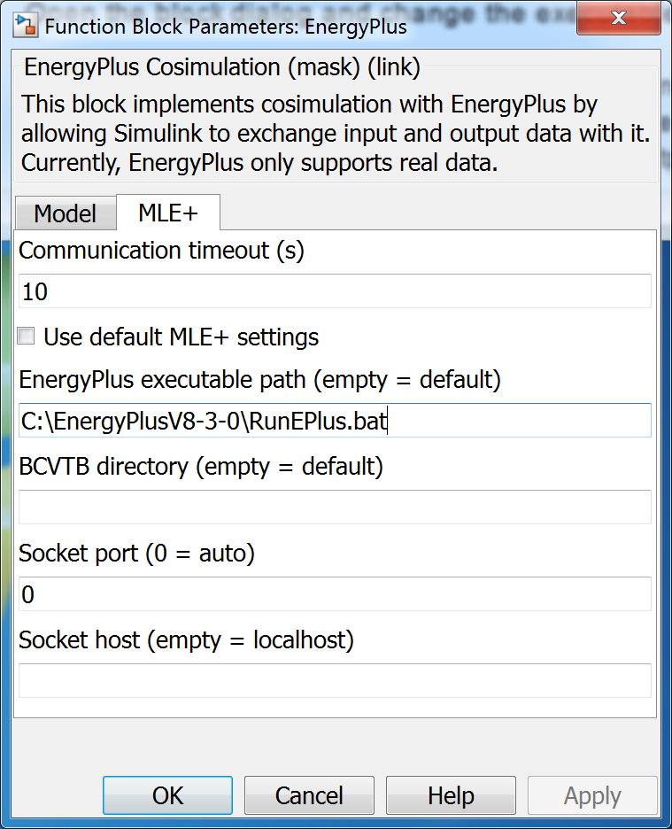
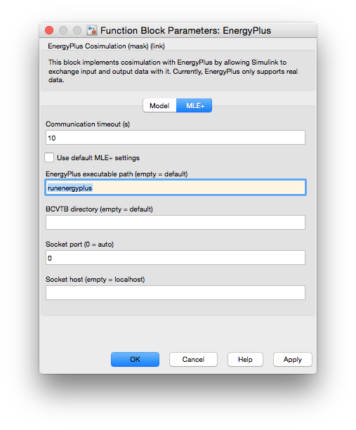

# MLE+
MLE+ is an open-source Matlab/Simulink toolbox for co-simulation with the whole-building energy simulator EnergyPlus. It is designed for engineers and researchers who are familiar with Matlab and Simulink and want to use these software tools in building energy simulation.

MLE+ capabilities include the following:

1. Co-simulation with EnergyPlus.
2. Co-simulation with Simulink models (Simscape).
3. Allow advanced controls in Matlab to operate EnergyPlus buildings.
4. Allow multiple simulation environments to cooperate.
5. Compatible with the [Campus Energy Modeling framework](https://github.com/NREL/CampusEnergyModeling).
6. Allows to seamless integration with Real-Time machine for Hardaware-in-the-loop simulations.

**NOTE:** Other two versons of MLE+ are available:

1. [Legacy Version](http://txn.name/mleplus/mlep_manual.html): This is the original distribution developed by Nghiem Truong.
2. [Graphical user interface](http://www.seas.upenn.edu/~mbehl/mleplus.html): This is graphical user interface for MLE+. This requires the graphics package from Matlab to run. 

# Download & Installation
1. Download MLE+.
  * You can download the latest version from [here!](https://github.com/willybernal/mlep/archive/master.zip) or clone this repository.

2. Extract files
  * Extract all files to a directory in your computer, for example **C:\software\mlep**.

3. Requirements. You need to install the following software before running MLE+:

  1. [EnergyPlus](https://energyplus.net/). You will need **the path to the installation directory** when installing mlep.
  2. [Java](https://www.java.com/en/download/manual.jsp). You will need **the path to the installation directory** when installing mlep.
  3. [Matlab](http://www.mathworks.com/products/matlab/).

  **Note: The examples on the current mlep distribution will only work for a specific version of EnergyPlus. However, if you create your own examples, you should be able to run all supported EnergyPlus versions.**  

4. Matlab
  * Open Matlab and change the current directory to the **C:\software\mlep\mlep** folder that has just been created.

5. Run installMlep.m
  * In Matlab, open the installation script **installMlep.m** located in **C:\software\mlep\mlep\installMlep.m** and follow the instructions included in the file.
  * According to the file instructions, add the **EnergyPlus path** (e.g. 'C:\EnergyPlusV8-3-0') and the **Java path** (e.g. 'C:\Program Files\Java\jre1.8.0_51\bin'). After the modifications running the script will add the necessary paths to the Matlab environment.

  **NOTE: Please read further installation instructions on installMlep.m**

6. Test installation
  * In Matlab, go to the **Examples/LegacyExample** folder and open **simple.slx**. You will need to change the settings (double click on the mlep function block) according to your E+ installation. 

# Supported Versions:
The following versions have been tested and should be running without problems.

1. **Windows:**
  * Matlab 2012b, 2013b, 2015a.
  * EnergyPlus 8.1, 8.2, 8.3, 8.4, 8.5.
  
2. **Mac:**
  * Matlab 2012b, 2013b, 2015a.
  * EnergyPlus 8.1, 8.2, 8.3, 8.4, 8.5.

**Note: The current example included in this repo requires EnergyPlus 8.5. You can convert EnergyPlus files to other versions using the  [IDF Version Updater.](http://bigladdersoftware.com/epx/docs/8-5/auxiliary-programs/idf-version-updater.html)**

# Examples
1. Legacy example:
2. MPC example:
3. Augmented simulation capabilities:
4. Integrated Campus Modeling examples:

# MLE+ Tutorial
1. You can find more information about setting up the EnergyPlus file.
2. Building Control Test Bed (BCVTB) 
3. Please find the mlep tutorial for this repo [here](./doc/tutorial/tutorial.pdf)

# MLE+ Projects
1. SPL HIL.
2. Integrated Campus Modeling framework.
3. Microgrid testing.

# Awards
* [Best Demo Award at BuildSys 2012](http://www.buildsys.org/2012/),
4th ACM Workshop On Embedded Systems For Energy-Efficiency In Buildings,
Toronto, Canada.

# Publications
* Willy Bernal, Madhur Behl, Truong Nghiem, and Rahul Mangharam, ["MLE+: A Tool for Integrated Design and Deployment of Energy Efficient Building Controls"](http://repository.upenn.edu/mlab_papers/51/), . October 2012.
* Willy Bernal, Madhur Behl, Truong X. Nghiem, and Rahul Mangharam, ["Campus-Wide Integrated Building Energy Simulation"](http://repository.upenn.edu/cgi/viewcontent.cgi?article=1104&context=mlab_papers), IBPSA Building Simulation Conference, International Building Performance Simulation . December 2015.
* AWS paper.

# Simulink Block Configuration
Windows Configuration:

Mac Configuration:

